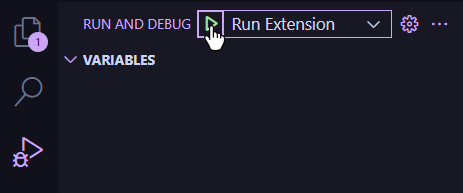

# The Gillian Platform - VSCode extension
*The official VSCode extension for [The Gillian Platform](https://github.com/GillianPlatform/Gillian)*

This extension provides:
- Debugger support for Gillian
- Language server support for Gillian
- Syntax highlighting for GIL, JSIL & WISL

## Quick start
To try out the extension, set up and build the project with:
```bash
npm i
(cd debug-ui; npm i)
npm run build
```

Then, go to the *"Run and Debug"* sidebar and click the play button with *"Run Extension"* selected.



This assumes that you have the Gillian source code in the sibling directory `../Gillian`; if not, adjust `gillian.sourceDirectory` in [`examples/.vscode/settings.json`](./examples/.vscode/settings.json).
